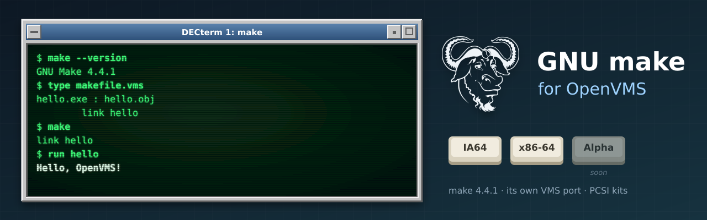

<p align="center">
  
</p>

# GNU make for OpenVMS

[GNU make](https://www.gnu.org/software/make/) (**4.4.1**) built natively for OpenVMS on
**IA64** and **x86-64**, following make's own releases. It belongs to the same family as
[GNU grep](https://github.com/issinoho/vms-grep), [GNU sed](https://github.com/issinoho/vms-sed),
[GNU awk](https://github.com/issinoho/vms-awk), [GNU m4](https://github.com/issinoho/vms-m4),
[GNU Bison](https://github.com/issinoho/vms-bison), [flex](https://github.com/issinoho/vms-flex),
[GNU Wget](https://github.com/issinoho/vms-wget), [curl](https://github.com/issinoho/vms-curl),
[PCRE2](https://github.com/issinoho/vms-pcre2) and [zlib](https://github.com/issinoho/vms-zlib)
for OpenVMS.

Like gawk, **GNU make ships its own OpenVMS port**: `makefile.com` (a DCL build),
`src/config.h-vms` and the VMS sources (`vmsjobs.c`, `vmsify.c`, ...). This repository builds
with it and holds **only our changes**: every build starts from the signed GNU release
tarball (Paul Smith's key), applies our patches where upstream's VMS port has fallen behind
make 4.4 and VSI C, and adds our own VMS files in `vmsport/`.

## Status

**Released: [v4.4.1-vms1](https://github.com/issinoho/vms-make/releases/tag/v4.4.1-vms1).**

| | IA64 (OpenVMS V8.4-2L3, VSI C 7.4) | x86-64 (OpenVMS E9.2-4, VSI C 7.7) |
|---|---|---|
| Builds with upstream's `makefile.com` | yes | yes |
| DCL smoke test: version, a DCL recipe makes a target and a second run finds it up to date, `-n`, functions and a command-line variable in a recipe, a pattern rule with `$<` and `$@`, error statuses for a failing recipe and a missing makefile | 8/8 | 8/8 |
| Kit install, smoke test on the installed image, remove | clean | clean |
| PCSI kit (`MAKE`, `V4.4-1E1`) | `ISSINOHO-I64VMS-MAKE-V0404-1E1-1.PCSI` | `ISSINOHO-X86VMS-MAKE-V0404-1E1-1.PCSI` |

## Installing the kit

Download the kit for your architecture from the
[latest release](https://github.com/issinoho/vms-make/releases/latest) and check it against
the release's `SHA256SUMS`. A kit downloaded through a non-VMS system loses its record
format, so restore that first, then install it:

```
$ SET FILE/ATTRIBUTE=(RFM:FIX,LRL:8192,MRS:8192,RAT:NONE) ISSINOHO-*-MAKE-V0404-1E1-1.PCSI
$ PRODUCT INSTALL MAKE /PRODUCER=ISSINOHO /SOURCE=dev:[dir]
$ @MAKE$ROOT:[000000]MAKE$SETUP.COM
```

It installs `[MAKE.BIN]MAKE.EXE`; `MAKE$SETUP.COM`, which defines the `make` and `gmake`
commands; the manual (`MAKE.TXT`, `MAKE.1`), `NEWS`, `COPYING`, our `README.VMS` and GNU
make's own notes on its VMS port (`README_UPSTREAM.VMS`) in `[MAKE.DOC]`; and
`SYS$STARTUP:MAKE$STARTUP.COM`, which defines `MAKE$ROOT` (add it to
`SYS$MANAGER:SYSTARTUP_VMS.COM`). `PRODUCT REMOVE MAKE` removes it.

## Using make on OpenVMS

Run from DCL, make runs each recipe line as a DCL command in a subprocess, so makefiles are
written for VMS. A `$` that DCL should see is written `$$`, as in any makefile:

```make
out.txt : in.txt
	copy in.txt out.txt

show :
	write sys$$output "built $(words a b c) things"
```

- **Makefile names:** make looks for `MAKEFILE.VMS`, `GNUMAKEFILE` and `MAKEFILE`, in that
  order. `README_UPSTREAM.VMS` describes the rest of the VMS behaviour (file lists, the
  `GNV$` settings, built-in rules).
- **Capturing make's output:** run make at the terminal, in a batch job, with
  `PIPE make > make.log` or with `SPAWN/OUTPUT=make.log`. Not with `DEFINE/USER SYS$OUTPUT`:
  the subprocesses that run the recipes cannot write to that file (`%DCL-W-UNDFIL`).
- **Case of arguments:** quote upper-case options and variable assignments (`"CC=cc"`), or
  `$ SET PROCESS/PARSE_STYLE=EXTENDED` first; batch jobs use the TRADITIONAL style.
- **Exit status:** a failed make exits with an error severity, so `ON ERROR` works.

## Patches

Upstream's VMS port was last tested on Alpha, IA64 V8.3/V8.4 and VAX, and has not kept up
with make 4.4 or current VSI C. The patches are VMS-only (`#ifdef VMS` or `config.h-vms`):

| Patch | Purpose |
|---|---|
| 0001 | `src/config.h-vms`: include `mkcustom.h` by name, not as `../src/mkcustom.h`; `HAVE_STRERROR`, `HAVE_UMASK`, and `HAVE_STPCPY` from C RTL 8.5. |
| 0002 | `src/job.h`, `src/job.c`: VMS passes the command line as a string; no `construct_command_argv` on VMS; `sigblock (0)` for the missing `siggetmask()`. |
| 0003 | `src/makeint.h`, `src/misc.c`, `src/mkcustom.h`: keep the system's `SA_RESTART` and the C RTL's `mempcpy` macro. |
| 0004 | `src/vmsjobs.c`: `LIB$SPAWN` stores the pid in the `struct child` (make 4.4 passes a `struct childbase`). |
| 0005 | `lib/glob.c`: no `alloca()` declaration when `alloca` is a macro. |

## How to build

Set up `tools/nodes.conf` as described in
[vms-grep's README](https://github.com/issinoho/vms-grep#2b-build-on-vms-from-the-host-over-ssh).

```sh
git clone https://github.com/issinoho/vms-make.git
cd vms-make
tools/prepare.sh            # fetch + verify, patch, overlay, kit inputs
tools/build.sh ia64         # upload, then @[.VMSPORT]BUILD (upstream's makefile.com)
tools/build.sh ia64 ALL KEEP_GOING   # compile everything, listing every failure
tools/test.sh ia64          # smoke test
tools/kit.sh ia64           # PCSI kit -> out/kits/
```

## Roadmap

1. GNU make's own test suite (Perl) on VMS.
2. Offer the patches to GNU make's VMS port.
3. A port to OpenVMS **Alpha**.

The family of ports, all for IA64 and x86-64, each following its upstream releases:

| Port | Latest release | |
|---|---|---|
| GNU grep — [vms-grep](https://github.com/issinoho/vms-grep) | [v3.12-vms3](https://github.com/issinoho/vms-grep/releases/tag/v3.12-vms3) | with `grep -P` through PCRE2 |
| PCRE2 — [vms-pcre2](https://github.com/issinoho/vms-pcre2) | [v10.49-vms1](https://github.com/issinoho/vms-pcre2/releases/tag/v10.49-vms1) | the regular-expression library |
| GNU sed — [vms-sed](https://github.com/issinoho/vms-sed) | [v4.10-vms1](https://github.com/issinoho/vms-sed/releases/tag/v4.10-vms1) | the stream editor |
| GNU awk (gawk) — [vms-awk](https://github.com/issinoho/vms-awk) | [v5.4.1-vms1](https://github.com/issinoho/vms-awk/releases/tag/v5.4.1-vms1) | built with gawk's own VMS port |
| zlib — [vms-zlib](https://github.com/issinoho/vms-zlib) | [v1.3.2-vms1](https://github.com/issinoho/vms-zlib/releases/tag/v1.3.2-vms1) | the compression library |
| curl — [vms-curl](https://github.com/issinoho/vms-curl) | [v8.22.0-vms1](https://github.com/issinoho/vms-curl/releases/tag/v8.22.0-vms1) | alongside VSI's curl kit, following curl's own releases |
| GNU Wget — [vms-wget](https://github.com/issinoho/vms-wget) | [v1.25.0-vms2](https://github.com/issinoho/vms-wget/releases/tag/v1.25.0-vms2) | the web retriever |
| GNU m4 — [vms-m4](https://github.com/issinoho/vms-m4) | [v1.4.21-vms1](https://github.com/issinoho/vms-m4/releases/tag/v1.4.21-vms1) | the macro processor |
| GNU Bison — [vms-bison](https://github.com/issinoho/vms-bison) | [v3.8.2-vms2](https://github.com/issinoho/vms-bison/releases/tag/v3.8.2-vms2) | the parser generator |
| flex — [vms-flex](https://github.com/issinoho/vms-flex) | [v2.6.4-vms1](https://github.com/issinoho/vms-flex/releases/tag/v2.6.4-vms1) | the scanner generator; runs GNU m4 |
| **GNU make** (this port) — [vms-make](https://github.com/issinoho/vms-make) | [v4.4.1-vms1](https://github.com/issinoho/vms-make/releases/tag/v4.4.1-vms1) | built with make's own VMS port |
| GNU diffutils — [vms-diffutils](https://github.com/issinoho/vms-diffutils) | [v3.12-vms1](https://github.com/issinoho/vms-diffutils/releases/tag/v3.12-vms1) | cmp, diff, diff3, sdiff |
| GNU patch — [vms-patch](https://github.com/issinoho/vms-patch) | [v2.8-vms1](https://github.com/issinoho/vms-patch/releases/tag/v2.8-vms1) | applies diffs |

## Artwork

`docs/images/banner.svg` and `docs/images/icon.svg` were made for this project in the style
of classic DECwindows and VT terminals, like those of its sibling ports. The GNU head is by
Aurelio A. Heckert, used under the terms on <https://www.gnu.org/graphics/heckert_gnu.html>.

## Licence

GNU make is free software under the GNU General Public License, version 3 or later; see
`COPYING`. Our patches and VMS files are distributed under the same terms.

OpenVMS is a trademark of VMS Software, Inc. This project is not affiliated with VMS
Software, Inc. or with the GNU project.
